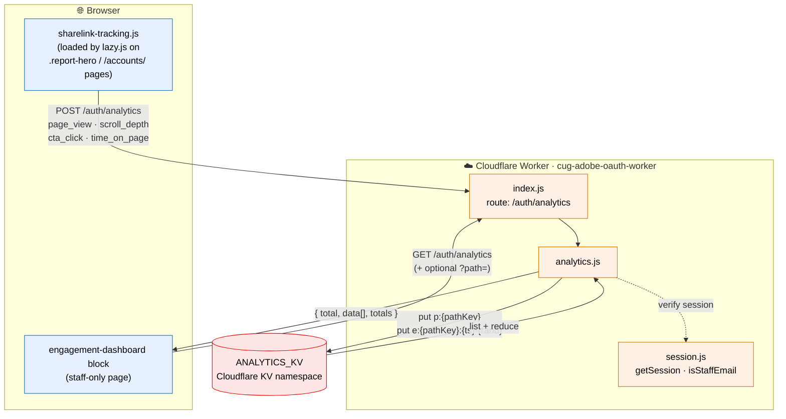
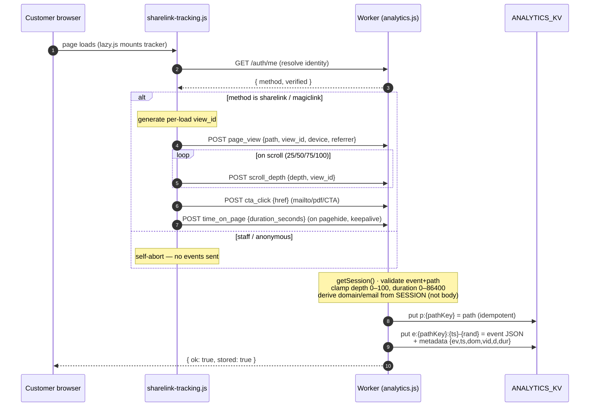
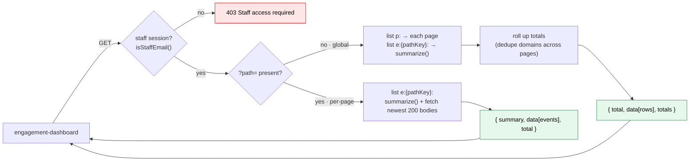
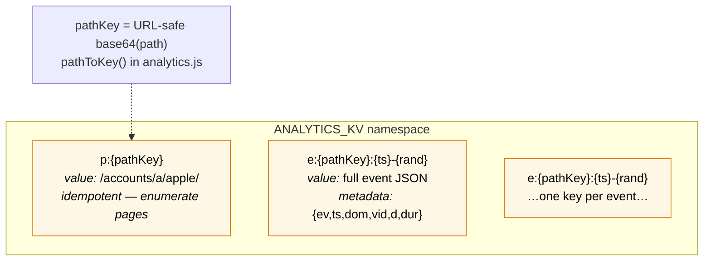
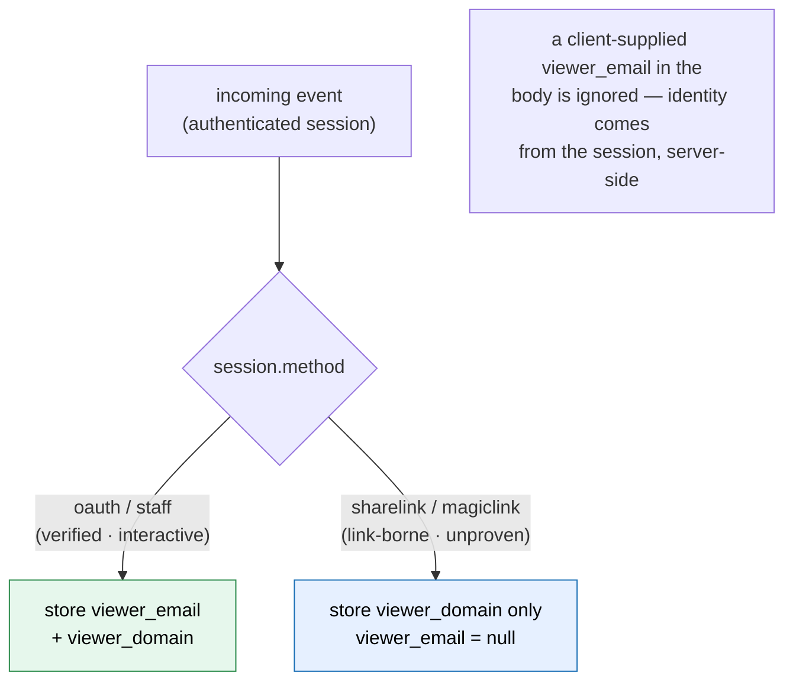

# Share-link Engagement Analytics — Architecture

100% capture of customer interactions on pages accessed via share/magic links.
Events are written directly to Cloudflare KV by the auth Worker (never through
sampled telemetry), and a staff-only dashboard reads them back.

## System overview



## Capture path (write) — POST /auth/analytics



## Dashboard path (read) — GET /auth/analytics



## KV schema (ANALYTICS_KV)

Every event is its **own immutable key** — no read-modify-write, so concurrent
events on the same page can never overwrite each other (this is what makes
"100% capture" hold). Summaries are computed on read.



**Derived-on-read metrics** (`summarize()`): `total_views`, `unique_visitors`
(distinct domains), `avg_scroll_depth` (mean of **furthest depth per view_id**,
not per milestone), `cta_clicks`, `avg_time_seconds`, `first_viewed`,
`last_viewed`. The global response adds a `totals` object that de-duplicates
visitor domains **across** pages.

## Privacy model



## Where each piece lives

| Component | Location | In Git repo? |
|---|---|---|
| `sharelink-tracking.js` (client) | `scripts/utils/` | ✅ yes |
| `engagement-dashboard` block | `blocks/engagement-dashboard/` | ✅ yes |
| `analytics.js` (Worker handler) | `workers/cloudflare/cug-adobe-oauth-worker/src/` | ✅ yes |
| `ANALYTICS_KV` (event data) | Cloudflare edge (KV namespace) | ❌ hosted by Cloudflare |
| DA sheets (`/data/*.json`) | Adobe DA content store, served via Edge Delivery | ❌ authored in da.live |
```

> Note: event **data** is not stored in the repo or as files — it lives in the
> Cloudflare KV namespace referenced by `id` in `wrangler.toml`. See PROJECT.md
> → "Share-link engagement analytics" for the full write-up.
