# Amplify your brand visibility
## Staff demo and conversation guide

> CONFIDENTIAL | Internal staff use only. The restricted staff Word copy contains a shared activation login. Do not give it to visitors, display the credentials, or post it publicly.

Use the **Digital Opportunity Report** to discuss AI visibility, SEO and website performance, then choose a useful next step with the visitor.

This is a guided report conversation. You do not need to tour every section, and the booth does not change the customer's website.

### Index

| Demo route | Staff reference |
| --- | --- |
| [Your five-minute route](#your-five-minute-route) | [10. How to explain AI signals](#10-how-to-explain-ai-signals) |
| [1. Staff access and setup](#1-staff-access-and-setup) | [11. How to explain search signals](#11-how-to-explain-search-signals) |
| [2. Open the right company report](#2-open-the-right-company-report) | [12. How to explain site experience](#12-how-to-explain-site-experience) |
| [3. Choose an industry example](#3-choose-an-industry-example) | [13. Never Say](#13-never-say) |
| [4. Orient the visitor](#4-orient-the-visitor) | [14. Objection handling](#14-objection-handling) |
| [5. Explain the AI visibility score](#5-explain-the-ai-visibility-score) | [15. Readiness and recovery](#15-readiness-and-recovery) |
| [6. Make one competitor comparison](#6-make-one-competitor-comparison) | [16. First-screen setup test](#16-first-screen-setup-test) |
| [7. Compare the AI platforms](#7-compare-the-ai-platforms) | |
| [8. Turn a finding into an action](#8-turn-a-finding-into-an-action) | |
| [9. Close and clear the visit](#9-close-and-clear-the-visit) | |

<!-- pagebreak -->

## Your five-minute route

| Time | What to do | What to say |
| --- | --- | --- |
| 0:00-0:30 | Ask what matters most: AI visibility, SEO or performance. | "Is your priority being found in AI answers, growing search traffic, or improving the website experience?" |
| 0:30-1:00 | Open their company report. If unavailable, choose an industry demo. Briefly confirm the website. | "Let's use your report, or an industry example if yours isn't available." |
| 1:00-2:45 | Follow their priority: LLM visibility, Search performance or Performance insights. | "Which finding matters most to your business?" |
| 2:45-3:30 | Always check Performance insights for major issues, even in an AI or SEO conversation. | "Let's also check whether slow or unresponsive pages could affect the people reaching your site." |
| 3:30-4:30 | Choose one finding and a next step. | "Which customer question, search topic or important page should we investigate first?" |
| 4:30-5:00 | Email the existing company report if wanted; clear the screen. | "You can use the emailed link to open and download the report for 30 days." |

### If you have only 90 seconds

Ask their priority, open their report or an industry example, show one relevant finding, glance at performance, and agree one next step. Always identify an example company as illustrative.

### What the visitor should leave with

An understanding of one finding that matters to them, and a clear next action with the booth or account team.

<!-- pagebreak -->

## 1. Staff access and setup

> HIGHLY CONFIDENTIAL | Keep this page internal. Sign in before visitors arrive. Never read the password aloud, leave it visible on the visitor screen, or share this document externally.

**Staff sign-in:** [https://act.aem.now/login?staff&redirect=%2Fbooth](https://act.aem.now/login?staff&redirect=%2Fbooth)

**Booth:** [https://act.aem.now/booth](https://act.aem.now/booth)

| Staff access | Value |
| --- | --- |
| Username | **{{STAFF_USERNAME}}** |
| Password | **{{STAFF_PASSWORD}}** |

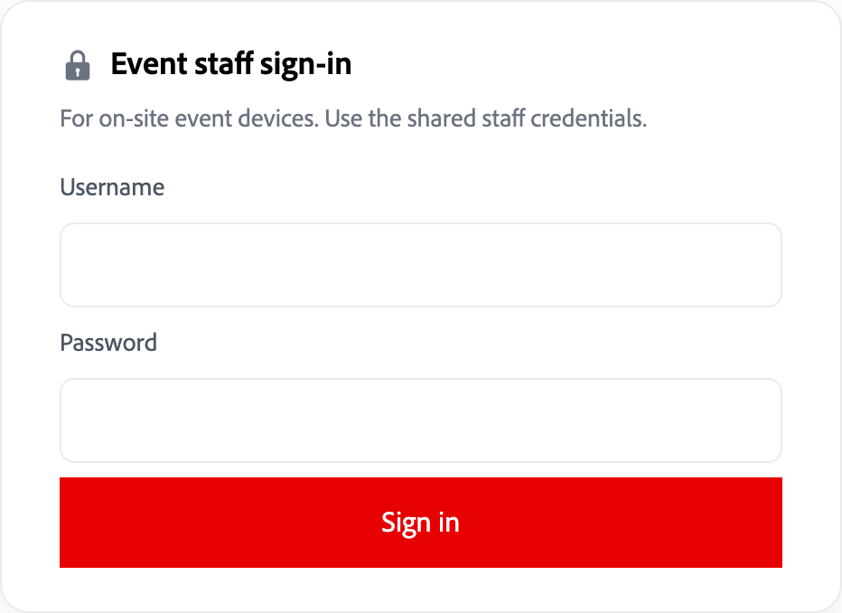

*Figure 1. Use Event staff sign-in. The screenshot intentionally has empty fields.*

Before visitors arrive, complete the [First-screen setup test](#16-first-screen-setup-test). Keep this guide on a separate staff device, not the visitor screen.

Point out Entry's privacy notice when a visitor enters their email: Adobe records email and report activity for 90 days to measure booth interest. Searching does not request sales contact.

Before each shift, use [Readiness and recovery](#15-readiness-and-recovery).

<!-- pagebreak -->

## 2. Open the right company report

**Do:** At [https://act.aem.now/booth](https://act.aem.now/booth), invite the visitor to enter their **Registration email** and select **View my report**.

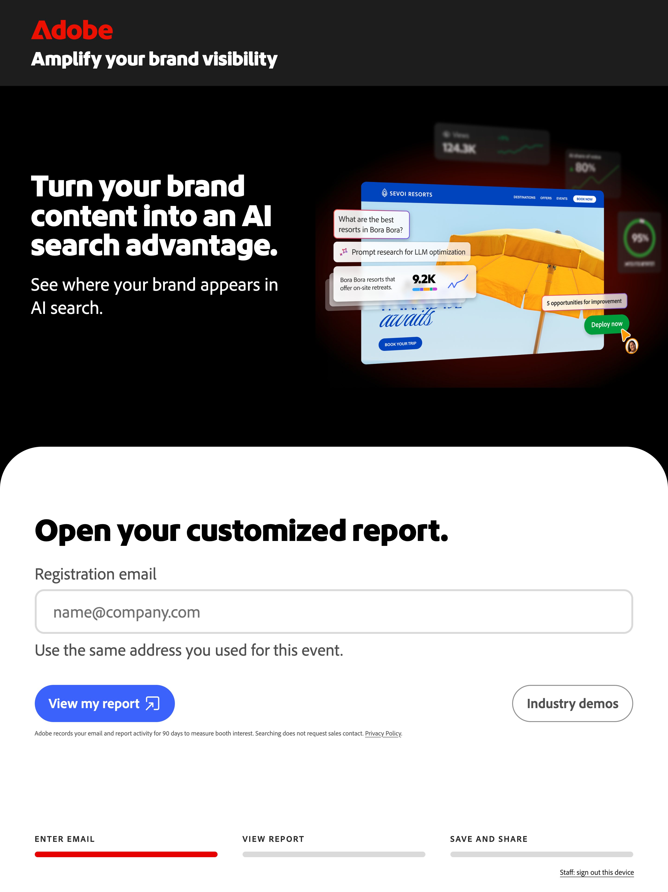

*Figure 2. The current Entry screen. Let the visitor enter their own email.*

### When a company report is available

**Say:** "Is this the right website?" If a website picker appears, let the visitor choose.

### When a company report is not available

Use **Industry demos**. Agree team follow-up: a report can be generated later and sent as a **magic link valid for 30 days** to open and download it.

Confirm the website and contact details separately. The booth does not request or generate reports; do not promise a delivery time.

<!-- pagebreak -->

## 3. Choose an industry example

**Do:** Select **Industry demos**, then choose the industry closest to the visitor's business. For practice, use **Consumer goods / coffee - Frescopa**.

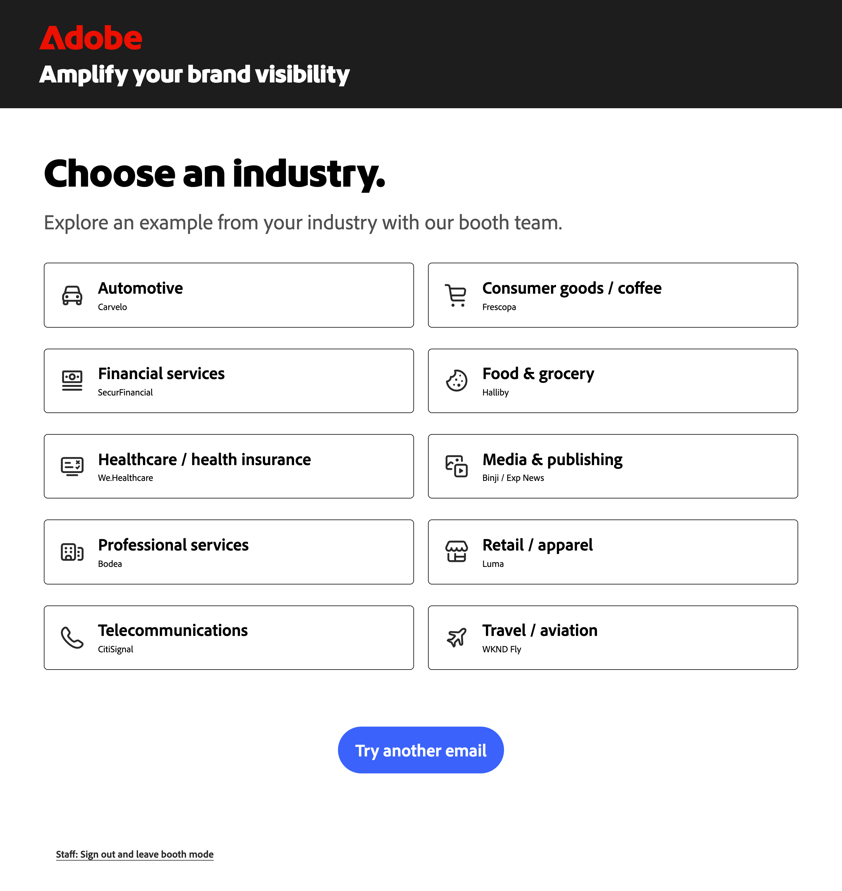

*Figure 3. All available industry examples. These are demo companies.*

**Say:** "This is an example company. It shows the type of report we can discuss; these are not results for your business."

The report's control bar also says **Example report** and **Not a report for your company**. Keep that distinction clear throughout the conversation.

<!-- pagebreak -->

## 4. Orient the visitor

**Do:** Confirm the company and website at the top of the report. Read any date and market shown before discussing the results.

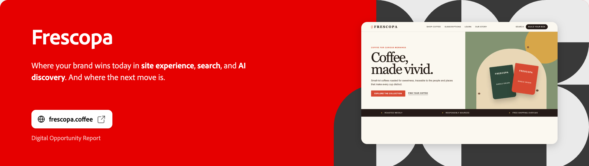

*Figure 4. Frescopa is the illustrative company used throughout this guide.*

Scroll to **Your briefing**. Its **Executive overview**, **Search & AI visibility**, and **Site experience** buttons change the briefing slide. **The slides are also swipeable:** swipe left or right through them.

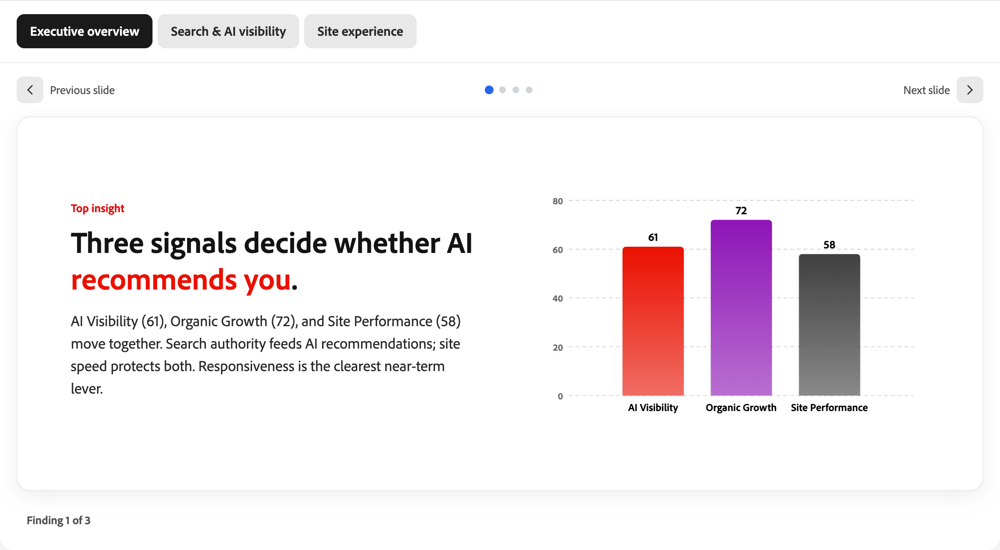

*Figure 5. Use the briefing to choose a direction, rather than reading every section.*

**Say:** "This report connects how people discover the brand with the experience they reach on its website. Which part matters most to you?"

Use **LLM visibility** for AI discovery, **Search performance** for SEO, or **Performance insights** for site experience. Always take a quick look at performance for major issues, even if the visitor's priority is AI or SEO.

<!-- pagebreak -->

## 5. Explain the AI visibility score

Scroll to **LLM visibility**, the report's AI visibility section.

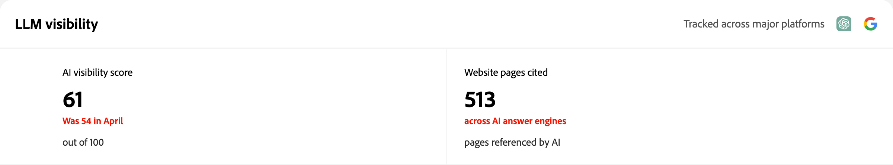

*Figure 6. AI visibility and cited pages are different measures.*

### What the score means

**Say:** "The score runs from 0 to 100. It looks at how often your brand appears in AI answers and across how many different topics. A higher score means stronger presence in the answers measured."

### Where the data comes from

**AI measurements come from Semrush Enterprise AIO, within Adobe Brand Visibility.** Adobe Brand Visibility is the unified customer-facing product; Semrush provides the AI measurement capabilities used here.

**Say:** "Semrush keeps a broad set of prompts - questions buyers might ask about your industry. It runs them periodically across AI platforms and checks whether your brand appears in the answers. The score considers both how often it appears and how many topics it covers."

These are sampled answers, not AI providers' real-user query logs or a live AI chat.

### Why more mentions can still mean a lower score

More mentions alone do not always mean a higher score. A brand mentioned often only for coffee pods can score lower than one appearing across pods, subscriptions and brewing advice.

### What the number does not mean

**61 out of 100 does not mean 61% of AI users saw the brand.** It is not market share, website traffic, or proof of customer preference.

**Website pages cited** counts the report's pages referenced in AI answers. It is not a count of visitors, clicks, or sales.

**Ask:** "Is the brand showing up on the topics you most want to be known for?"

<!-- pagebreak -->

## 6. Make one competitor comparison

**Do:** Stay in **LLM visibility** and point to **Competitive landscape**. Start with the visitor's brand and one competitor.

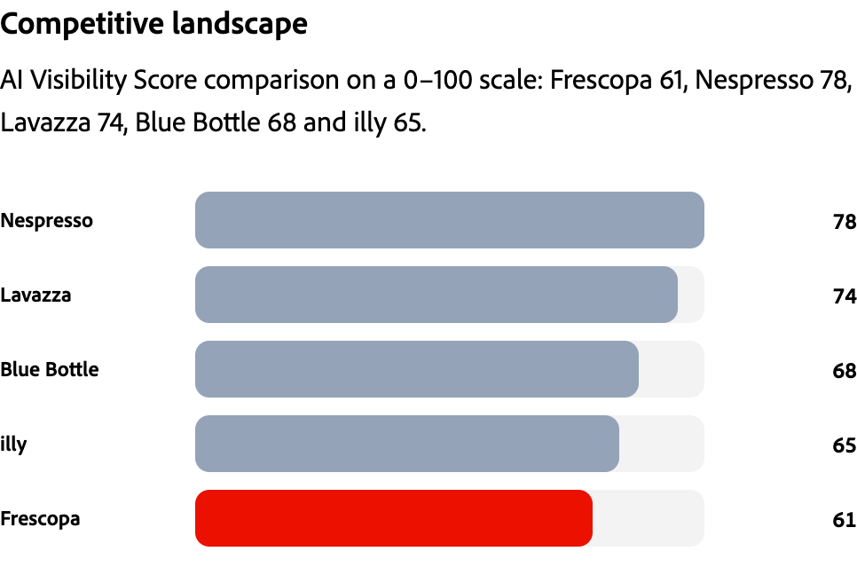

*Figure 7. Frescopa and the report's selected competitors. These example scores are illustrative.*

### A line you can rehearse

**Say:** "Frescopa scores 61 and Nespresso scores 78. That's a 17-point gap in this example. It gives us a reason to investigate which customer questions each brand answers well."

**Ask:** "Which competitor, and which category question, would matter most to your team?"

### Turn the comparison into a useful question

For a coffee business, a possible discussion topic is choosing a coffee subscription. Agree which page should help a customer answer that question.

The chart shows the report's comparison set, not every company in the market. Say **points**, not "percent more customers" or "lost revenue."

<!-- pagebreak -->

## 7. Compare the AI platforms

**Do:** Use **Platform visibility** if the visitor cares about a particular AI experience. Read the platforms and values actually shown.

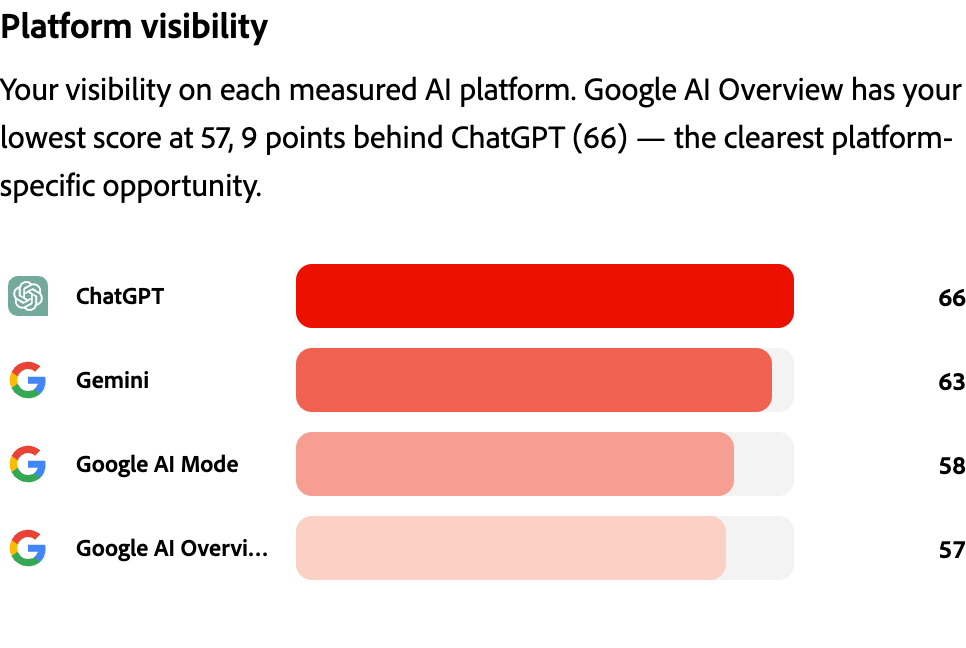

*Figure 8. Frescopa's platform scores. The last label is Google AI Overview.*

### A line you can rehearse

**Say:** "In this example, ChatGPT is 66 and Google AI Overview is 57. That's a 9-point difference within Frescopa's platform scores. Which of these experiences matters most to your customers?"

Use the answer to choose a topic or page to review. Do not add the platform scores together or average them to recreate the overall score.

### If the visitor asks whether this is live

**Say:** "This is a report of measured AI visibility, not a live ChatGPT conversation. The industry example is illustrative."

Stay with the report's date, market and platform labels. Do not promise coverage of an AI platform that is not shown.

<!-- pagebreak -->

## 8. Turn a finding into an action

Follow the visitor's priority: AI **Key findings**, SEO **Search performance**, or **Performance insights**. Always check performance for major issues. Open **Read analysis** if shown.

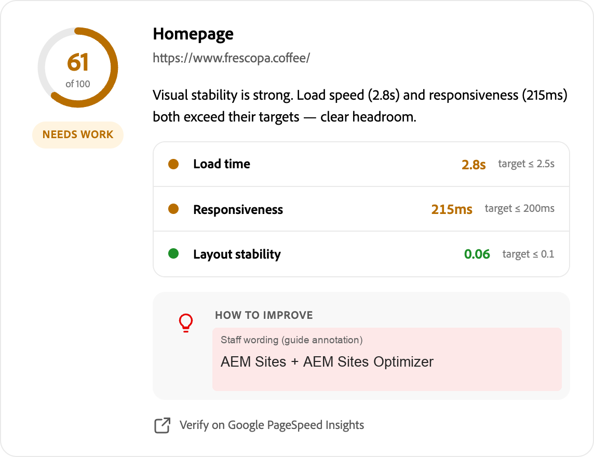

*Figure 9. The complete Homepage card. Measurements are unchanged; the labeled naming callout is a guide annotation.*

**Source: Google PageSpeed Insights**, using Lighthouse lab tests and CrUX real-user data where available. Check the measurement labels.

**Say:** "This example page loads in 2.8 seconds, above its 2.5-second target. We would check what's slowing it down before choosing a fix."

**Ask:** "Which page matters most to the people you're trying to reach?"

### Agree one practical next step

For AI, review content for a customer question. For SEO, check a topic's demand, ranking and relevant page. For performance, investigate an important page's measurements outside target.

Match the finding to **Adobe Brand Visibility**, **Semrush Enterprise SEO**, **AEM Sites Optimizer** or **AEM Sites**. The booth makes no changes; faster pages do not guarantee AI citations.

<!-- pagebreak -->

## 9. Close and clear the visit

**Say:** "The useful takeaway is [the finding]. The next step is [the question, page or action we agreed]."

### On a company report

Select **Finish reading my report** to open the closing screen.

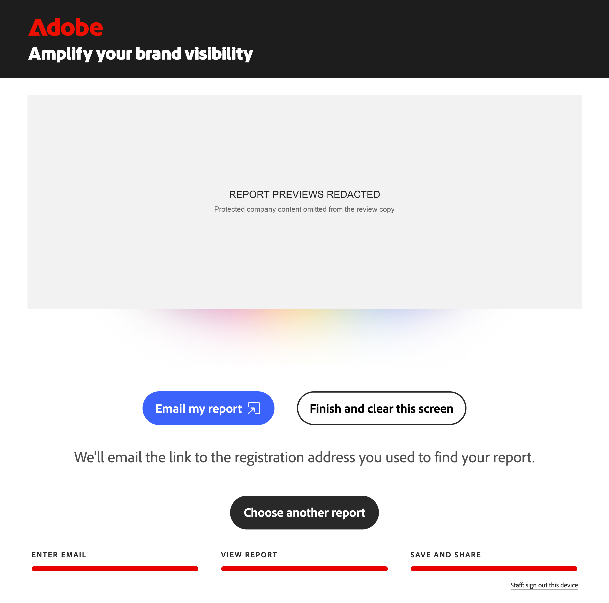

*Figure 10. The company-report closing screen. Swipe left or right through the three previews, or tap a side preview.*

**Email my report** sends a **magic link to the registration email used for lookup**. The visitor can use it on their own device to access the report and download its PDF for **30 days from issue**. Downloads are not opened on the shared booth screen.

Check the on-screen send result, then select **Finish and clear this screen**. Emailing a report does not request sales contact; agree any follow-up separately.

<!-- pagebreak -->

### On an industry example

Agree a follow-up conversation with the booth team. Select **Clear for next visitor**. Use **Change industry** only if another example would help.

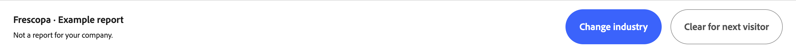

*Figure 11. Industry examples have different closing controls from company reports.*

**Before the next visitor:** Check that Entry is back and the email field is empty. Emailing a report does not request sales contact; agree any follow-up separately.

For questions, use [Objection handling](#14-objection-handling). For a stalled screen or an uncertain result, use [Readiness and recovery](#15-readiness-and-recovery). Surface issues to **José Correia** and the booth lead.

> CONFIDENTIAL | Keep the guide and shared login on staff devices. Do not send this document as the visitor's report.

<!-- pagebreak -->

## 10. How to explain AI signals

Use these answers for **LLM visibility** and the AI cards in **Your briefing**. Frescopa's numbers are illustrative, not the visitor's results.

| Signal | Customer-safe explanation | Do not confuse it with |
| --- | --- | --- |
| AI Visibility / AI visibility score: 61/100 | "How often the brand appears in AI answers, and across how many different topics. Higher means stronger measured presence." | Not 61% of users, market share, or a simple mention count. See [Explain the AI visibility score](#5-explain-the-ai-visibility-score). |
| AI Visibility Trend: +7 vs. April | "The score moved from 54 to 61: an increase of 7 points since April." | Not 7% more visitors. Check the dates and comparison context; it is not continuous live monitoring. |
| Website pages cited: 513 | "Pages from the website referenced as sources in AI answers." | Not 513 visitors, clicks, sales, or a guarantee that users followed the links. |
| Competitive landscape | "The same type of visibility score compared with the competitors shown. Frescopa trails Nespresso by 17 points." | Not the entire market, customer preference, or a percentage of lost revenue. |
| Platform visibility | "How the brand's visibility differs across the AI platforms shown. ChatGPT is 66; Google AI Overview is 57 in this example." | Not platform audience size. Do not average these scores to recreate the overall score. |

### If asked where the AI evidence comes from

**Say:** "The data comes from Semrush Enterprise AIO within Adobe Brand Visibility. Semrush runs a broad panel of industry-related prompts periodically, then records brand mentions and website citations in the answers. The score combines frequency with breadth across topics."

This is not a feed of what every user asked an AI provider. The prompts and topics shown are a sample, not the whole panel.

Read the date, market and platform labels in the report. Different coverage or periods can produce different results. Do not promise a refresh schedule or a platform that is not shown.

### Keep the scope clear

A report concerns the website/domain shown. Do not present one domain's score as a combined score for every brand or website in a customer's portfolio.

<!-- pagebreak -->

## 11. How to explain search signals

Look under **Search performance** and **Your briefing**. Semrush search figures are estimates, not the customer's analytics logs.

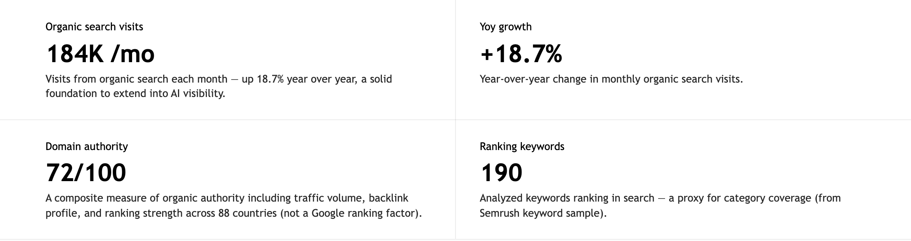

*Figure 12. Frescopa's search signals. Scores, visit counts and growth percentages have different meanings.*

| Signal | Customer-safe explanation | Do not confuse it with |
| --- | --- | --- |
| Organic Growth: 72/100 | "A summary score for organic search strength and growth potential. Use the visit and trend figures to explain it." | Not 72% traffic growth. It is separate from the +18.7% growth figure. |
| Organic search visits: 184K/mo | "Estimated visits from unpaid search each month." | Not exact analytics visits, unique people, paid traffic or AI-referred visits. |
| YoY growth: +18.7% | "Estimated monthly organic visits increased 18.7% compared with a year earlier." | Not growth in revenue, conversion or AI visibility. Read the dates and market. |
| Domain authority: 72/100 | "A combined search-strength score using traffic, links and rankings." | Not a Google-issued score or a Google ranking factor. |
| Ranking keywords: 190 | "The keywords in the analyzed sample that rank in search." | Not every keyword the business ranks for, or 190 visitors. |
| Category & intent | "The topic and likely purpose of a search, such as Purchase or Research." | Not proof that a particular visitor is ready to buy. |
| Monthly searches: 90.5K/mo | "Estimated demand for a term such as espresso beans." | Demand for the term, not visits to the brand. |
| Position: Rank 11 | "The reported search position for that term. A smaller rank number is better." | Not a fixed position for every person, location or search. |
| Retail benchmarks: +393% / 42% | "U.S. retail: AI traffic grew 393% YoY in Q1 2026; March conversion was 42% higher than non-AI traffic." | Not company results or a promise. The 42% is relative uplift, not percentage points. |

<!-- pagebreak -->

## 12. How to explain site experience

Use **Site experience** in the briefing and **Performance insights**. [Turn a finding into an action](#8-turn-a-finding-into-an-action) includes the complete Homepage card.

**Source: Google PageSpeed Insights**, using Lighthouse lab tests and CrUX real-user field data where available.

| Signal | Customer-safe explanation | Do not confuse it with |
| --- | --- | --- |
| Site Performance: 58/100 | "The report's summary of website performance. Use the individual page cards to find the next action." | Not 58% of visitors having a good experience. It is not every page's score. |
| Page performance score: 61/100 | "A performance score for the named page. Homepage is 61 in this example." | Not the AI visibility score, even when both happen to be 61. |
| Load time / LCP: 2.8s | "How long the main content takes to appear. The target shown is 2.5 seconds or less." | Not the time until every image and script has finished loading. Lower is better. |
| Responsiveness / INP: 215ms | "How quickly the page responds visibly to a tap or click. The target is 200 milliseconds or less." | Not network speed or the time needed to finish a purchase. Lower is better. |
| Layout stability / CLS: 0.06 | "How much visible content shifts unexpectedly. The target is 0.1 or less." | Not seconds or a percentage. Lower is better; 0.06 is within target. |

### Scores and timing measures are different

For the page's 0-100 performance score, the bands shown are **90-100: Good**, **50-89: Needs work**, and **0-49: Poor**. Do not apply these bands to AI visibility or domain authority.

For load time, responsiveness and layout stability, compare each value with **its own target**. A page can have good stability but still need work on load time and responsiveness.

### If asked whether these are real-user measurements

A **lab score** comes from a controlled test. **CrUX field data** comes from real Chrome visitors over a rolling 28-day period; it may describe a page or the wider site.

Read the source label and **How we measure performance** before naming the method. If unclear, explain the value and target without guessing; ask **José Correia** and the booth lead to confirm.

### What a finding or recommendation means

**Key findings** and **How to improve** suggest where to investigate. They are not proof of the cause, a completed change, or a guarantee of more AI citations or revenue.

<!-- pagebreak -->

## 13. Never Say

Use the right-hand wording when a conversation risks going beyond the evidence. These are speaking guardrails, not a script to read aloud.

| Never say | Say instead |
| --- | --- |
| "This is real-user usage data from AI providers." | "The AI evidence comes from sampled category questions, not direct provider usage logs." |
| "61 means 61% of users saw your brand." | "It is a score out of 100 that considers how often the brand appears and how many topics it covers." |
| "This is your AI share of voice." | "This is an AI visibility score. It is not a share-of-voice percentage." |
| "These competitors represent the entire market." | "They are the report's comparison set. Let's check which competitors matter to your business." |
| "This proves customers prefer another brand." | "Appearance in AI answers and customer preference are different questions." |
| "Missing data means there is no issue." | "That evidence is unavailable. We need more information before reaching a conclusion." |
| "These retail benchmarks are your results." | "They describe the sector and period named in the source, not this company's performance." |
| "This fix will guarantee revenue or an AI recommendation." | "It gives us a focused action to investigate and measure. The outcome is not guaranteed." |
| "This example is your company's report." | "Frescopa is an illustrative example, not a report for your company." |

### Keep the action and consent clear

The booth does not apply website changes. Emailing an existing report does not request sales contact; agree any follow-up separately.

Use **Adobe Brand Visibility** in the customer conversation. Keep credentials and internal service names out of view and out of the talk track.

<!-- pagebreak -->

## 14. Objection handling

Acknowledge the concern, explain the evidence, then propose a next action. Use the [AI](#10-how-to-explain-ai-signals), [search](#11-how-to-explain-search-signals) and [site experience](#12-how-to-explain-site-experience) definitions; do not invent a formula.

| Visitor question | A useful response |
| --- | --- |
| "These SEO numbers don't match our analytics." | "Your analytics are the source of truth for exact visits and conversions. Semrush provides estimates for trends and comparison. Let's align the market and dates, then validate the priority with your own data." |
| "Our site feels fast on my laptop." | "That can be true on office Wi-Fi. Google PageSpeed mobile tests and real-user data can tell a different story. Let's check the method and choose one important page to investigate." |
| "AI citation numbers feel abstract. Where do they come from?" | "Fair point: they're not impression logs. Semrush periodically runs industry-related prompts and checks brand mentions and citations. Let's choose a topic where you want stronger presence." |
| "More mentions should mean a higher score." | "Mentions are volume; the score also rewards breadth across topics. Many mentions in a narrow area can score lower. Let's compare topic coverage, not just totals." |
| "Is this live, or every AI user's activity?" | "No. It's a report of sampled answers, not a live chat or provider query logs. Let's use the date, market and platforms shown to frame the comparison." |
| "Why these competitors?" | "They are selected for the industry, region and business context, not the whole market. Which are relevant to you? If a match is wrong, we'll flag it for correction." |
| "Why only a few pages?" | "It's a sample of validated pages, not a full-site audit; access restrictions can limit coverage. Which business-critical page is missing? We'll capture it for the team to review." |

<!-- pagebreak -->

### Objection handling: value and next steps

Keep the next step specific to the visitor's business. Agree a question, page, owner or measurement; do not turn a finding into an unsupported promise.

| Visitor question | A useful response |
| --- | --- |
| "Is this just a generic Adobe pitch?" | "It shouldn't be. Each recommendation should connect to a finding in your report. Let's choose the evidence that matters to your business before discussing a product." |
| "We're not on Adobe's CMS." | "The report is still useful: it identifies AI, search and performance opportunities regardless of your CMS. Let's scope the finding first; the team can confirm which tools fit your current setup." |
| "We already have an SEO tool." | "That gives us useful context. SEO traffic and AI-answer visibility measure different parts of discovery. Let's compare what you already track with one AI question your customers care about." |
| "How do we know this is worth doing now?" | "Let's avoid a broad commitment. Pick one important page or topic, an owner and a success measure, then agree a small test and review date." |
| "Can you fix this or guarantee an uplift now?" | "The booth doesn't change your site, and the result isn't guaranteed. Let's choose a focused action and measure it against a baseline with your team." |
| "Our company isn't available." | "We can use an industry example today and agree a follow-up. The team can generate your report later and send a magic link valid for 30 days to access and download it." |

**If you cannot answer confidently:** "I don't want to guess. Let's capture that question for the team." Surface uncertain data, missing coverage or incorrect content to **José Correia** and the booth lead. Do not promise a delivery time or product capability you have not confirmed.

<!-- pagebreak -->

## 15. Readiness and recovery

### Presenter readiness checklist

- [ ] Staff login works; Entry is open with an empty email field.
- [ ] The industry example, touch keyboard and display readability work.
- [ ] The [First-screen setup test](#16-first-screen-setup-test) is complete.
- [ ] You know the signals, [Never Say](#13-never-say), and how to reach José Correia.
- [ ] Before each visitor: confirm the website; clearly identify examples.
- [ ] After each visitor: Entry is empty; the previous report is gone.

### Troubleshooting & recovery

| Situation | Staff response |
| --- | --- |
| Login fails | Check the staff sign-in link and credentials privately. If it still fails, tell José Correia and the booth lead. Never display the password to visitors. |
| Company report unavailable | Check the email; use Industry demos. Agree team follow-up for a later report and 30-day magic link; do not promise timing. |
| Data is missing | Say the evidence is unavailable and use a signal that is present. A blank, dash, or failed test with N/A is not proof of zero visibility or zero performance. |
| Wrong website or questionable result | Stop interpreting it. Check the website, dates and market. Flag it to José Correia and the booth lead; use an example if needed. |
| Entry returns during a pause | An inactive session can reset. Check Entry is clean, then reopen the report or example. Never use browser Back to restore a previous visitor's report. |
| Report stalls or says it expired | Use Retry and clear screen if shown. Confirm Entry returns empty before reopening a report or example. If it stays stuck, pause the device and ask the booth lead. |
| Clear does not return to empty Entry | Do not start another visit or leave the previous report visible. Pause use of the screen and ask the booth lead to restore a clean Entry state. Reloading alone is not proof of a cleared visit. |
| Report email is not confirmed | Read the on-screen result. Do not repeatedly press Send or promise delivery. Capture the question with the visitor's permission, agree a team follow-up, then clear the screen. |

If the device cannot recover, pause it and move the visitor to the booth team.

**Report issues to José Correia and the booth lead.** Include the screen/device, time, website and what you did. Send a screenshot privately if useful; keep visitor email and report details out of public channels.

<!-- pagebreak -->

## 16. First-screen setup test

**For the first person setting up each screen.** Run this short check on the actual event display before visitors arrive. Use its normal touchscreen and keyboard.

> HIGHLY CONFIDENTIAL | This approved email belongs to the test inbox owner. Use it only for setup. Keep it on the staff device and clear it from the booth when finished.

| Setup test | Value |
| --- | --- |
| Test email | **{{SETUP_TEST_EMAIL}}** |
| Expected report | **Unity / unity.com** |

Open [https://act.aem.now/booth](https://act.aem.now/booth), using the login in [Staff access and setup](#1-staff-access-and-setup). **Test the email lookup, not a direct report link.**

| Check | Test | Pass when |
| --- | --- | --- |
| [ ] 1 | Enter the test email with the touch keyboard. | Typing and editing work. Dismiss the keyboard; View my report is reachable and the screen is readable from the visitor's position. |
| [ ] 2 | Select View my report. If a website picker appears, choose Unity - unity.com. | Unity opens and its header says unity.com. No access error or stuck loading screen. An industry example does not pass this check. |
| [ ] 3 | Scroll down and back up; look for major visual issues. | The report appears cleanly: no missing chart bars, overlapping text, clipped controls or unwanted sideways scrolling. |
| [ ] 4 | Open Finish reading my report; swipe the previews both ways. | Finish shows the same Unity report. All three previews are reachable and the closing buttons are visible. |
| [ ] 5 | Use Choose another report if shown; choose Unity again. | The picker returns and Unity reopens without typing the email again. |
| [ ] 6 | Clear the screen. If browser Back is available, try it. | Entry is empty; the previous report is gone and Back does not restore it. Do not unlock a kiosk to expose blocked controls. |

**Leave the screen on empty Entry.** Surface failures to **José Correia** and the booth lead, using [Readiness and recovery](#15-readiness-and-recovery). A demo-company fallback is not proof that the Unity lookup works.

**No email test is required on site.** José verifies email delivery separately; installers do not need inbox access or to send a test report.
